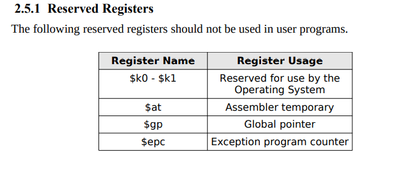

# Assignment 3:

MAKE SURE TO HAVE \n IN THE END OF THE INPUT

- Pratyush Saini (2019CS10444)
- Anirudha Kulkarni (2019CS50421)

#### Preface:

Postfix expressions are a way of representing mathematical expression consisting of operators and operands wherein, the position of operators leads the position of operands. The following MIPS assembly program evaluates the value of an input postfix expression by means of a stack data structure.

#### Input:

MIPS assembly language program with following instructions:

**add, sub, mul, beq, bne, slt, j, lw, sw, addi**

#### Build Instructions:

Program can be run easily with make instructions:

1. To Build: `make build`
2. To run executable from build `make run`
3. To remove build file `make clean`

All these steps can be performed by `make all` which will remove previous build, create new one and give output.

#### Directory Structure:

1. `build` directory stores executable generated
2. `input.txt` stores input file
3. `main.cpp` is source code
4. `testcases` directory stores testcases

#### Approach:

Code is diveded into 3 sections:

1. Control unit
2. Register file
3. Memory

Register file and memory are initialised appropriately as empty. Input from given file is read and passed to the control unit. Control unit is responsible for taking all the decisions based on the type of instruction

##### Error Handling / Faulty Test Cases:

- wqe
- qw
- wqr
- wrq
- qwr

efew

#### Output

The output consists of:

- State of program at each occurence of an operator. That is, whenever an operator is read, the operation executed at that particular iteration is printed to the console.
- The final value of the input expression is displayed at the end of console, in case of valid input postfix expression. Else, appropriate error is raised.

#### Test Cases:

Find extensive testing details under Testing/README.md

1. sasf
2. asgf
3. dg
4. sdg
5. dsg
6. sd
7. g

**TO DO**:

1. Raise exception when used anyone from this

Dataflow:

1. instruction vector contains instructions in format: "abc abasas, saffsa, asf" etc
2.
