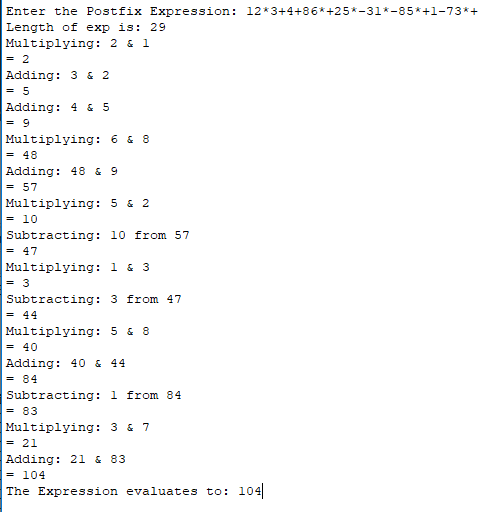
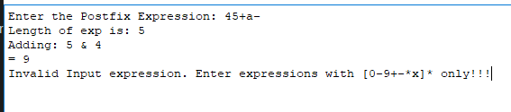
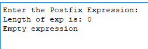
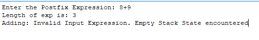
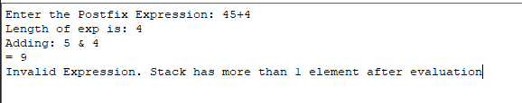

## Testing:

Assumptions in code:

- Input string is a valid postfix expression - can be converted to infix
- Input string has length >0
- Input string contains only integers and +-\* operators

Error can occur when an assumption fails. So testing can be done to validate all assumptions and error handeling when assumption is violated

1. simple string with all 3 operations:

This test is to make sure all the 3 operations are working correctly without overflow issues

1 2 _ 3+4+ 8 6 _ +2 5 _-3 1 _ -8 5 _ +1-7 3 _+ =

1 _ 2 + 3 + 4 + 8 _ 6 - 2 _ 5 - (3 _ 1) + 8 _ 5 - 1 + 7 _ 3 = 104

2. invalid inputs

This test is to check any characters apart from integers and 3 operators in the input string

45+a- = 4+5 - a

3. Empty expression

This is to handle corner case with no input at all

4. Case of faulty Input string where the stack becomes empty in the middle of parsing

This is to test error handeling if string is not a valid postfix expression as it demands to pop from an empty stack

8+9 = invalid postfix

5. input string where the stack's size is not 1 at the end of parsing:

This is to test if at the end of parsing stack size is not equal to 1

45+4 = invalid postfix

