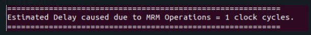

## Testing:

**Anirudha Kulkarni : 2019CS50421**
**Pratyush Saini : 2019CS10444**

### 1.  Verification of example given in Problem statement with respect to our implementation


Explaination:


### 2. Multi core starving:

There can be a case when a core never leaves the MRM and keeps on sending request to MRM due to algorithmic bias. Hence we have starving limit on each core after which the core must get lower priority and release the MRM.


Here we have a lot of DRM requests from Core #1. And as the core #1 is giving algorithmic benefit of lesser clock cycles core #2 was likely to be starved. But by handeling starvation in we see change in cycle 153 to 154 that Row 1 is loaded into row buffer which corresponds to Core #2


Again after resolving starving we change back to algorithmically most beneficial request that is corresponding to core #1.


Hence finally :


### 3. Lookahead for increased throughput:

Input:


Working:


Without lookahead:


With Lookahead:


### 4. Exception in case of infinite loop / unbounded recurssion:

Consider this case:


Output is an exception:


### 5. Exception in a Core should not affect others:

consider core 1 as with invalid input exception:


core 2 as:


We have exception raised for Core #1:


But the other program executes completely:


### 6. Maximizing throughput by parallel processing:

Input of core 1:


Input of core 2:


Input of core 3:


Finally




### 7.

Input of core 1:


Input of core 2:


Input of core 3:


Input of core 4:


Throughput, IPC and total instructions:


#### Exceptions:

1. Out of bound access:

```bash
main:
   sw $s0, 100000000000($s0)
```


2. Non existent register:

```bash
main:
   addi $s9, $s12, 12
```


3. Invalid instruction:

```bash
main:
   sw5 $s0, 1024
```


4. Invalid Branch:

```bash
main:
  j abc
```


5. Invalid syntax of instruction:

```bash
main:
   addi $s0, $s1, $s2
```


